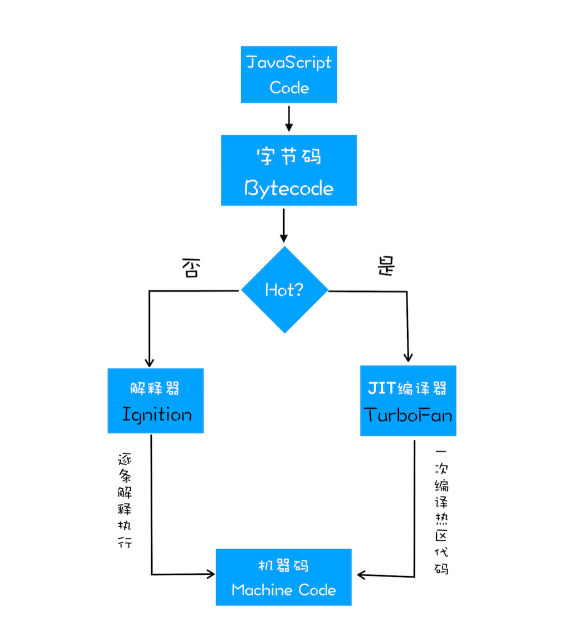

## 我是如何理解编译的？

通常我们通过机器执行程序时，机器是无法直接‘理解’我们写的源码的（因为，机器读的都是二进制流），所以我们在执行程序之前，需要对源代码继续编译生成机器码。

传统编译语言的流程中，程序的一段代码在执行之前都会经历三个步骤，统称编译：

- 词法/语法分析：例如：分析变量的类型、语句中空格是否具有意义等
- 生成抽象语法树（AST）：通过上述分析，将语法单元流转成一个逐级嵌套的程序语法结构树。
- 代码生成（生成机器码）：将AST转换为可执行代码的过程。这个过程与语言，目标平台等相关。

比起编译过程只有三个步骤的语言的编译器，JavaScript引擎要复杂得多，特别是在【代码生成】阶段。

在讲【代码生成阶段】时，我们先讲讲当前火热的V8引擎，下面是V8引擎的执行流程：

上面是V8执行JavaScript代码的流程图。可以看到，V8在执行过程中既有解释器，又有编译器。

V8执行的过程大致如下：

- Parse阶段：V8引擎负责将JS代码转换成AST
- 解释器阶段：解释器将AST转换为字节码，解析执行字节码也会为下一个阶段优化编译提供需要的信息；
- 编译器阶段：编译器利用上个阶段手机的信息，将字节码优化为可以执行的机器码；
- 垃圾回收阶段：将程序中不在使用的内存空间进行回收。

我们发现上面的执行过程步骤中，比传统的编译多了一个生成字节码的步骤。

### 生成字节码

V8之前，解释器会把AST直接转成机器码，这个过程存在一定的性能问题，因为他会把AST全都转成机器码，这导致内存占用大的问题。

当V8出来之后，引擎框架引入了字节码，它是介于 AST 和机器码之前的一种代码。需要将其转换成机器码后才能执行，字节码可以理解为是机器码的一种抽象。
解释器除了可以快速生成没有优化的字节码外，还可以执行部分字节码。

### 生成机器码

生成机器码的过程同样，做了一些特殊处理。在上一步【生成字节码】过程中，解释器会对代码执行次数情况进行记录。最后把分析数据和字节码传给编译器。
它会根据分析数据，生成优化好的机器码。下一次执行这段代码（出现多次的代码片段）时，就直接执行机器码。这样性能遍提高很多。

对于编译器，它是 JIT（即时编译）优化的编译器，因为 V8 引擎是多线程的，编译器的编译线程和生成字节码不会在同一个线程上，这样可以和解释器相互配合着使用，不受另一方的影响。下面是JIT技术的工作机制：

## 总结

1. 编译大体有三个步骤，语法/词法分析、生成抽象语法树、根据AST程序机器码
2. V8引擎在生成机器码的步骤，对比以往做了优化，引入了【字节码】。
   - 根据 AST 生成字节码，同时分析数据，对执行多次的代码进行记录。
   - 根据字节码，以及分析数据生成机器码。下一次遇到相同代码直接执行机器码。
